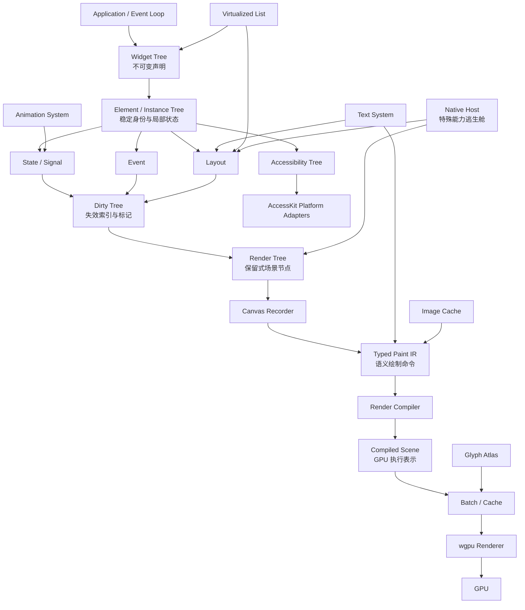

# tgui `canvas_all` 分支 GUI 架构探索计划

## 摘要

当前分支只有最小化的 `tgui` crate，没有需要兼容的旧公开 API。本计划将其作为一次独立的架构实验：

- 采用声明式 Widget + 持久 Element/Instance Tree。
- 使用单向响应式状态和事务式更新。
- 使用 Taffy 完成布局，使用保留式 Render Tree 和 typed Paint IR。
- 目标平台为 Windows、macOS、Linux。
- 首期保持单 crate，内部按职责分层，稳定后再拆分。
- 以正确性和可验证的增量更新为第一优先级。
- Native Host 只作为特殊能力逃生舱，不参与普通 Button、Text、List 的实现。

## 总体架构



虽然概念图中没有单独列出 Element Tree，但声明式模型必须增加这一层。Widget 可以在重建时被替换，Element 才负责保存稳定身份、局部状态、生命周期和依赖订阅。

`Dirty Tree` 不是另一份 UI 真相，而是覆盖在 Element/Render Tree 上的失效索引。所有真正的状态和布局数据只保存在对应的树中。

`Paint IR` 保持后端无关、语义化和中等粒度；`Render Compiler` 将它编译为可批处理的 `Compiled Scene`，不要求一个 Paint Command 对应一次 GPU draw。GPU 资源上传、缓存淘汰和场景提交通过资源代际解耦，缺失资源使用旧资源或 placeholder，不阻塞 UI 线程。

## 核心不变量

1. Widget 构建、测量、布局、绘制和语义收集阶段禁止直接修改应用状态。
2. 所有输入、动画、资源完成和后台任务结果都进入 UI 线程事务队列。
3. Widget 通过 `Key + WidgetType` 与旧 Element 对齐；稳定 key 的节点必须保留状态和身份。
4. Dirty Tree 的更新必须可合并、可重复消费，并能安全回退到整树重建。
5. 一帧提交采用原子提交：布局、Render Tree、语义树和资源引用形成一致的 CPU 快照后才替换上一帧；不得等待异步 GPU 上传完成。
6. 普通控件始终走 Widget -> Element -> Layout -> Render Tree -> Canvas/Paint IR -> Render Compiler 路径。
7. Native Host 不得成为普通 Button、Text、List 或其他标准控件的实现后门。
8. UI 树只由 UI 线程拥有；后台线程只能发送带代际信息的消息。
9. 高频节点数据优先使用代际 ID 加 Arena/Dense Storage；不能为每个普通节点默认分配独立的 `Box<dyn Trait>`。
10. 所有可淘汰的 CPU/GPU 资源都受显式预算和可观测淘汰策略约束；committed 或 in-flight frame 仍引用的资源不能被提前回收。
11. `SceneRevision`、`LayoutRevision`、`ResourceRevision` 和 `SemanticRevision` 单调递增，异步结果必须验证代际后才能影响当前树。

## 公共接口与内部边界

| 子系统 | 计划中的接口 |
| --- | --- |
| Application | `Application`、`WindowSpec`、事件循环、窗口调度和渲染提交 |
| Widget | `WidgetNode`、`Widget`/`View` 构建接口、`WidgetKey` |
| Core / Storage | 代际 `ElementId`、`RenderNodeId`、`NodeKey`、Arena/Dense Storage、树索引 |
| Element | 内部 `ElementId`、生命周期、状态槽位、依赖订阅、子节点对齐 |
| State | `State<T>`、`Signal<T>`、`UpdateTxn`、依赖追踪上下文 |
| Event | `UiEvent`、`EventPhase`、`EventContext`、焦点管理、Pointer Capture、IME |
| Layout | `LayoutStyle`、`Measure`、`LayoutSnapshot`、滚动和裁剪信息 |
| Dirty | 内部 `DirtyFlags`、`DirtyTree`、失效传播和提交 epoch |
| Render | `RenderNode`、`PaintCommand`、`Canvas`、`RenderCompiler`、`CompiledScene`、`Renderer` |
| Text | `TextSystem`、`TextLayout`、字体注册、字形运行和测量结果 |
| Media | `ImageSource`、`ImageHandle`、CPU 解码缓存、GPU 纹理缓存 |
| Animation | `FrameClock`、`Timeline`、`AnimationHandle`、可插值属性 |
| Virtualization | `VirtualList`、稳定 `ItemKey`、可变高度测量和 overscan |
| Native Host | `NativeHost`、`NativeHostFactory`、`HostHandle`、宿主能力描述 |
| Accessibility | `Semantics`、内部 `AccessibilityTree`、`AccessibilityAction` |
| Diagnostics | `FrameMetrics`、`CacheBudget`、Revision、资源/场景成本报告 |

公开 API 只暴露应用开发所需的构建、状态、事件、布局、文本、图片和动画接口。Element Tree、Dirty Tree、缓存代际、预算控制和大部分 Render Tree/Compiled Scene 细节保持 `pub(crate)`，通过调试/测试接口观察。

## 状态、事件与 Dirty Tree

### 状态模型

- `State<T>` 是可写状态句柄，`Signal<T>` 是只读或派生值。
- 在 Widget 构建、测量、绘制、语义阶段读取状态时，自动记录依赖。
- 状态写入不会立即重建树，而是进入 `UpdateTxn`，在当前事件传播结束后批量提交。
- 同一事务内的多次写入合并为一次失效。
- 后台资源任务通过 `UiDispatcher` 回传消息，不能直接访问 Element 或 Render Tree。

### DirtyFlags

失效原因和失效范围分开表达。原因使用以下 `DirtyFlags`：

- `STRUCTURE`：子节点、Widget 类型或 key 发生变化。
- `LAYOUT`：尺寸、位置、测量结果或滚动几何发生变化。
- `PAINT`：颜色、边框、透明度、文本样式或绘制内容发生变化。
- `HIT_TEST`：命中区域、裁剪、可见性或 Pointer Capture 相关信息变化。
- `SEMANTICS`：角色、名称、值、可操作状态或辅助功能边界变化。
- `RESOURCE`：图片、字体、字形或 GPU 纹理代际变化。

每个节点至少保存两组标记：

- `self_flags`：节点自身必须重新执行对应阶段。
- `subtree_flags`：后代存在对应失效，仅用于跳过干净分支和寻找最小工作根。

也可以将其实现为等价的 `CHILD_LAYOUT`/`CHILD_PAINT` 位，但不能把“子节点需要重绘”折叠成“父节点自身需要重绘”。例如 B 的颜色变化应得到 `B.self_flags = PAINT` 和祖先的 `subtree_flags = PAINT`，而不是让每个祖先都重新执行自己的 paint 回调。

传播规则：

- `STRUCTURE` 在发生子节点变更的 Element 上展开为自身的结构、布局、绘制、命中和语义失效，并向祖先合并对应的 `subtree_flags`。
- `LAYOUT` 在节点自身同时使绘制、命中和语义边界失效，并向上合并到能够覆盖其固有尺寸影响的最近 Layout Boundary；调度器选择最小布局根，而不是无条件重建整树。
- `PAINT` 只把 `subtree_flags` 传播到最近的 Render Boundary，并只重录受影响的 Scene Chunk。
- `HIT_TEST` 和 `SEMANTICS` 分别传播到最近的命中/语义提交根，不能借此触发无关布局或绘制。
- `RESOURCE` 至少触发绘制；如果固有尺寸改变，则同时触发布局。
- 同一提交 epoch 内的重复标记必须合并，Dirty Root 队列不得重复加入同一节点。
- 未能精确识别属性的依赖必须安全退化为整个 Element 失效，不能漏更新。

### 事件模型

统一输入为 `UiEvent`，覆盖：

- 鼠标、触摸、滚轮和拖拽。
- 键盘、焦点、快捷键。
- 文本输入和 IME。
- 窗口尺寸、DPI、激活状态和关闭请求。
- Accessibility action。

事件按命中路径执行：

1. Capture。
2. Target。
3. Bubble。

`EventContext` 提供：

- `stop_propagation`、`prevent_default`。
- `request_focus`、`release_focus`。
- `capture_pointer`、`release_pointer`。
- 向事务队列发送命令或更新状态。

命中测试使用上一帧已提交的 Layout/Render 快照，避免事件处理中间状态导致路径不一致。

## 数据布局、Revision 与帧提交

### ID 与 Arena/Dense Storage

Element Tree 和 Render Tree 在逻辑上是树，在内存中优先使用代际 ID 加连续存储：

- `ElementId`、`RenderNodeId` 和资源句柄包含 slot 与 generation，释放后重用 slot 也不能让旧句柄重新生效。
- 热路径数据保存在 `Vec`、dense arena 或等价的连续存储中；父节点、首子节点、下一兄弟等关系用 ID/索引表达。
- 常见 Widget、Element 和 Render Node 不采用“一节点一个堆分配”的默认实现，减少 pointer chasing、allocator 压力和 cache miss。
- trait object 只保留给真正需要动态扩展的冷路径或外部扩展点；其热数据仍应能下沉到 arena。
- UI 线程独占修改 arena；后台任务只持有不可变资源数据和带 generation 的完成消息。

先采用易验证的 AoS/dense arena；只有 profiling 证明收益后，才把布局、dirty bitset 等热点字段拆成 SoA。数据导向不能以破坏生命周期和调试可读性为代价。

### Revision 模型

每个窗口维护相互独立、单调递增的 Revision；只有对应子系统的可观察输出变化时才递增，因此一帧可以复用其他子系统的旧 revision：

| Revision | 含义 |
| --- | --- |
| `LayoutRevision` | 已提交布局几何、裁剪和命中快照的版本 |
| `SceneRevision` | Render Tree、Paint IR 和 Scene Chunk 内容的逻辑版本 |
| `ResourceRevision` | 字体、图片、glyph、纹理和 GPU buffer 可用状态的版本 |
| `SemanticRevision` | Accessibility Tree 内容与边界的版本 |

Scene Chunk 和缓存条目记录创建它们时的 revision 元组及失效原因。诊断接口必须能够回答“哪个 State/资源导致哪个 chunk 在哪一帧重建”。异步任务除 source generation 外还携带请求时的相关 revision；过期结果可以进入通用缓存，但不能覆盖当前 Element 的绑定。

### 原子 CPU 快照与异步 GPU 资源

原子提交指 CPU 可观察状态一致，不表示等待 GPU 资源全部就绪：

1. 排空本轮 `UpdateTxn`，完成 reconciliation 和 dirty 合并。
2. 构建彼此匹配的 pending Layout、Render、Paint IR 和 Accessibility 快照。
3. Render Compiler 使用稳定资源句柄编译；资源未就绪时复用兼容的旧资源或明确的 placeholder，并将上传加入队列。
4. pending 快照验证通过后一次性替换 committed 快照并提交 GPU 工作；失败时保留上一帧，必要时下一轮回退到全量重建。
5. 上传完成后通过 generation 校验，再递增 `ResourceRevision` 并只触发相关节点的 `RESOURCE/PAINT`，固有尺寸变化时额外触发 `LAYOUT`。

GPU 资源释放进入基于 submission/fence 的延迟回收队列。仍被 committed 或 in-flight frame 引用的纹理、atlas page、buffer 和 transient target 都不能被预算淘汰器立即销毁。

## Layout、Render Tree 与渲染编译

### Layout

- 使用 Taffy 作为 Flex、Grid、绝对定位和滚动布局引擎。
- Text、Image、VirtualList、NativeHost 通过统一 `Measure` 回调提供固有尺寸。
- 布局使用逻辑像素；DPI scale 只在物理渲染和字形 atlas 阶段转换。
- 测量缓存 key 至少包含可用宽高、样式、内容代际、字体代际和缩放比例。
- 布局结果保存为 `LayoutSnapshot`，包含矩形、基线、裁剪、滚动偏移和命中信息。

### Render Tree

Render Tree 是独立于 Widget/Element 的保留式场景：

- 每个 Render Node 保存边界、变换、裁剪、透明度、层级和命令区间。
- Render Boundary 形成可缓存的 Scene Chunk。
- Paint-only 更新只重建受影响的 chunk；前置条件不满足时回退到子树或整树重收集。
- Render Tree 不允许直接调用平台 GPU API。

### Paint IR 与 Canvas

`Canvas` 是命令记录与回放抽象，不再是直接写入 CPU 像素 buffer 的即时画布。普通 Widget 和自定义绘制都通过 Canvas 产生后端无关的 `PaintCommand`；命令保持语义化和中等粒度：

- 矩形、圆角矩形、路径、描边。
- 颜色、渐变、阴影、透明度和变换。
- Clip push/pop。
- Text Run、Image、Glyph Atlas 引用。
- Layer、Backdrop 或离屏合成边界。
- `NativeSurface` 占位命令。

Paint IR 不应退化为 `SetColor`、`MoveTo`、`LineTo` 等大量低级状态命令。应优先使用 `DrawRoundedRect { rect, radius, paint }` 这类能表达完整语义的中等粒度命令；Path 的内部线段由 Path 值自身聚合。这样既保留后端自由度，也避免 UI 树产生不可控的命令数量。

### Render Compiler 与 Compiled Scene

`RenderCompiler` 是 Paint IR 和 GPU 执行之间的明确边界：

- 验证 clip/layer 栈、变换、z-order、透明度和 Native Surface 边界，生成可诊断的编译错误。
- 将连续且兼容的矩形编译为 instance buffer，将 Text Run 编译为 glyph atlas 引用，将 Image 编译为纹理/采样绑定。
- 生成 `CompiledScene`，其中包含 render pass、batch、pipeline key、顶点/索引/instance 范围、纹理绑定、上传请求和资源代际；它不是另一份 Widget 真相。
- 允许复用未失效 Scene Chunk 的已编译结果；chunk revision、Renderer capability、DPI 和资源 revision 变化时才重新编译。
- 编译结果失败时保留上一份可提交的 Compiled Scene，或安全退化到子树/整树编译，不能提交半成品。

Paint Command 不与 GPU draw 一一对应。例如五个相邻 `FillRect` 应编译为一个包含五个 instance 的 `QuadBatch`，而不是五次 draw。

Batch/Cache 负责：

- 缓存 Scene Chunk、Compiled Scene、pipeline、顶点、索引、instance 和纹理绑定。
- 在裁剪、透明度、离屏层或 Native Surface 边界处切分 batch。
- 根据 chunk revision、DPI、主题、字体、图片、字形和 Renderer capability 代际生成缓存 key。
- 记录 Paint Command 数量、Compiled batch/pass 数量、缓存命中率、GPU 上传字节数和 transient target 成本。

GPU 路径的默认策略：

- 普通矩形优先使用 instance buffer。
- 文本使用分页 Glyph Atlas；atlas 淘汰只触发重新栅格化，不重新执行 Unicode shaping。
- 图片使用有预算的 GPU Texture Cache，必要时再做纹理 atlas。
- 阴影优先使用几何或批量 blur；不得默认每个 Button 分配一个 offscreen texture。

Layer、Backdrop、透明度隔离和离屏合成是高成本操作。每个 Render Chunk 必须记录 `offscreen_cost`、目标纹理尺寸、pass 数量和 transient VRAM 估算；诊断输出应能定位类似“1920x800、2 passes、12.3 MB transient VRAM”的成本。

首期不实现像素级脏矩形；先完成子树级保留式场景和正确的回退路径。未来如需 damage region，应先限定在稳定的 Scene Chunk 内部，而不是一开始引入全局像素级 damage 算法。

## Text System、Image Cache 与 Glyph Atlas

### Text System

首期使用成熟分层：

- `cosmic-text` 负责字体管理、Unicode shaping、双向文本、fallback、换行和行布局。
- Text System 对外提供测量、布局、命中测试、光标/选择几何和渲染运行。
- 布局缓存与 GPU 字形缓存分离。
- 缓存 key 包含文本内容或 span 代际、字体、字号、字重、语言、方向、宽度、换行策略和 DPI。
- GPU glyph page 被淘汰后只重新栅格化受影响 glyph；不得因为纹理淘汰而重复 Unicode shaping 或无关 TextLayout。

### Glyph Atlas

- 按字体实例、物理字号、变体和颜色字形类型建立 atlas key。
- 区分单色 mask glyph 与彩色 glyph。
- 使用分页 atlas 和空闲矩形分配器。
- atlas 页面有独立代际；淘汰后重新栅格化，不允许渲染旧纹理。
- 资源完成只触发受影响 Text Run 的 `RESOURCE/PAINT` 失效。

### Image Cache

分为三层：

1. `ImageSource` 身份和请求去重。
2. CPU 解码/栅格化缓存。
3. GPU Texture Cache。

要求：

- 支持路径、内存 bytes、URL 和 SVG。
- 图片解码与 SVG 栅格化可以在后台线程执行。
- 回 UI 线程时携带 source generation，旧任务结果必须丢弃。
- 加载期间可保留旧纹理或显示明确 placeholder。
- 使用有上限的 LRU/代际淘汰策略，并暴露缓存命中、失败和内存统计。

## CPU/GPU 缓存预算与资源策略

预算是资源系统的一等约束，而不是事后 profiler 的计数器。预算对象至少包括：

| 预算域 | 主要对象 |
| --- | --- |
| `CpuCacheBudget` | TextLayout、解码图片、SVG 栅格、Paint IR/Scene Chunk |
| `GpuCacheBudget` | 图片纹理、Glyph Atlas、顶点/索引/instance buffer、pipeline |
| `TransientGpuBudget` | Layer/Backdrop 离屏目标、临时 pass 纹理和 staging buffer |

要求：

- 每项预算支持软上限、硬上限、当前占用、峰值、命中、miss、evict、upload bytes 和失败原因统计。
- 淘汰优先级由可重建成本、可见性、最近使用时间和当前帧引用共同决定；仍被 committed/in-flight frame 引用的对象只能延迟回收。
- Glyph、图片和 TextLayout 缓存使用明确的 LRU/clock 或等价策略；超预算时优先释放可重新生成的 GPU 资源，不能无限增长 RSS/VRAM。
- `Layer`/`Backdrop` 的 transient 分配必须单独计费，并在超预算时返回可诊断错误或选择降级效果（例如关闭模糊），不能静默制造无限离屏纹理。
- 默认预算可由窗口/Renderer 配置覆盖；测试使用固定预算验证淘汰、generation 和 placeholder 行为。
- `FrameMetrics` 每帧输出 CPU/GPU/cache budget 快照，便于区分算法工作量、缓存占用和瞬时峰值。

## Animation System

- 统一 `FrameClock` 驱动所有动画，不允许每个组件创建独立定时器。
- `Timeline` 产生 `Animated<T>` 派生值，不直接覆盖用户的基础 State。
- 动画 key 为 `(ElementId, PropertyId)`；同一属性的新动画按显式策略替换、衔接或取消旧动画。
- 每帧只标记受影响的 `PAINT` 或 `LAYOUT` 属性。
- 支持暂停、取消、完成回调、测试用 fake clock 和 reduced-motion。
- 动画运行时由事件循环请求下一帧；没有活动动画时回到等待状态。

## Virtualized List

`VirtualList` 采用稳定 key、可变高度和 overscan：

- 数据源提供长度、稳定 `ItemKey` 和 item builder。
- 只构建可见范围加 overscan 范围内的 Element。
- 使用前缀和结构（优先 Fenwick Tree）维护估算/实测高度，支持按滚动偏移快速定位。
- item 高度变化时保持滚动锚点，避免内容跳动。
- Element 状态按 `ItemKey` 复用，不按当前可见索引复用。
- 支持键盘焦点、选择、滚动到 key 和异步测量。
- 可访问性树输出集合信息；聚焦到未物化 item 时先物化并滚动到目标。

## Native Host 逃生舱

Native Host 只用于 Paint Commands 无法表达的系统能力，例如 WebView 或外部原生 surface。

契约至少包含：

- 创建、挂载、卸载和销毁。
- 布局矩形、DPI、可见性和 z-order。
- 焦点、键盘/IME、指针输入转发。
- 原生 surface 或子视图的合成方式。
- 裁剪、透明度、变换能力声明。
- `NativeHostCapabilities`：是否需要独立 surface/offscreen、是否支持 transform、alpha、clip、输入转发和 batch 合并。
- `NativeHostCost`：独立 pass、surface、纹理或同步点的预估成本。
- 无障碍节点或子树桥接。
- 平台句柄和错误状态。

首个真实验证实现为可选 feature 下的 WebView/外部 surface host；其他平台先实现同一 trait 的适配层和 mock host。

约束：

- Button、Text、List、Input 等普通控件不得通过 NativeHost 实现。
- Native Host 的裁剪、透明度和任意变换能力必须显式声明；不支持时使用隔离层或返回可诊断错误。
- Host 不直接修改 Widget Tree，只通过事件和事务回传状态。
- Native Host 作为独立平台合成层处理，不能假设它能被普通 GPU batch 完全合并；Render Scheduler 必须依据 capabilities/cost 提前切分 pass 并记录代价。

## Accessibility Tree

- 从 Element 语义和 Layout 几何生成内部 Accessibility Tree。
- 语义节点具有稳定的 `NodeId`，由 Element 身份和 key 维护，不因兄弟节点重排而任意变化。
- 语义更新只由 `SEMANTICS`、焦点、布局边界或可访问滚动状态触发。
- 使用 AccessKit 连接 Windows UIA、macOS NSAccessibility 和 Linux AT-SPI。
- AccessKit action 统一回送到事件/命令系统。
- Native Host 可以提供 opaque node，也可以桥接自己的子树。
- Text 的辅助功能内容来自逻辑文本，而不是 Glyph Atlas。
- VirtualList 提供集合、位置、数量和当前项语义。

## 推荐模块结构

保持单 crate，但建立明确的内部边界：

```text
src/
  lib.rs
  application/
  core/
    id.rs
    arena.rs
  state/
  widget/
  event/
  layout/
  dirty/
  render/
    paint/
    scene/
    compiler/
    batch/
    cache/
    wgpu/
  text/
  media/
  animation/
  virtualization/
  native/
  accessibility/
  diagnostics/
  platform/
  widgets/
  test_support/
```

初始依赖基线可参考主分支已验证的组合，并集中维护在根 `Cargo.toml`：

- `winit`
- `wgpu`
- `taffy`
- `cosmic-text`
- `image`
- `resvg`
- `accesskit` 及三平台 adapter
- `raw-window-handle`
- `bytemuck`
- `crossbeam-channel` 或等价消息通道
- `wry` 仅作为可选 Native Host 示例依赖

版本应以当前 Rust 工具链可编译的稳定版本为准，避免把依赖版本散落到多个模块。Native Host/WebView 依赖不应进入最小核心路径。

### Cargo feature 分层

从第一阶段就保留可裁剪的 feature 边界，默认桌面体验不应强制携带 WebView 或无障碍适配器：

```toml
[features]
default = ["desktop", "text", "image"]
desktop = ["window", "render"]
window = ["dep:winit", "dep:raw-window-handle"]
render = ["dep:wgpu", "dep:bytemuck"]
text = ["dep:cosmic-text"]
image = ["dep:image"]
svg = ["dep:resvg"]
accessibility = ["dep:accesskit", "dep:accesskit_winit"]
webview = ["dep:wry"]
```

上表是边界示意，具体依赖 feature 名称以选定版本为准。`core`、状态、布局契约、headless Paint/命令测试和基础数据结构必须在关闭 `desktop`、`webview`、`accessibility` 时仍可构建；`resvg`、完整 image codec、AccessKit adapter 和 `wry` 不得无条件进入最小运行时或包体。

## 实施阶段

### 阶段 0：契约与测试骨架

- 建立代际 ID、dense arena、几何、颜色、错误和窗口抽象。
- 建立 headless `TestRenderer`、命令快照和确定性时钟。
- 建立 `FrameMetrics`、固定资源预算和基准 harness；先跑通 10/100/1,000 个 synthetic arena 节点的分配、遍历和回收基线。
- 完成模块骨架和架构不变量文档。
- `cargo check`、`cargo test` 和格式检查通过。

### 阶段 1：Widget、Element、State、Event

- 实现声明式 WidgetNode。
- 实现 keyed reconciliation、生命周期和局部 state slot。
- 使用 `ElementId` 与 arena 索引完成树遍历，记录每节点分配数和内存占用。
- 实现 State/Signal、事务队列和依赖追踪。
- 实现 capture-target-bubble、焦点、pointer capture 和基础 IME 路由。
- 完成最小 Container、Text 占位节点和 Button 示例。
- 跑通 10/100/1,000 节点的 initial build、idle、single state update 和 keyed reorder 基线。

### 阶段 2：Taffy Layout 与 Dirty Tree

- 接入 Taffy 和自定义 Measure。
- 实现 `self_flags`/`subtree_flags`、Dirty Root 去重、失效传播、提交 epoch、Layout Revision 和布局快照。
- 验证结构、布局、绘制、命中和语义失效之间的传播矩阵。
- 完成“增量结果等价于整树重建”的 headless 测试。

### 阶段 3：Render Tree、Paint IR、Render Compiler 与 wgpu

- 实现 RenderNode、Scene Chunk 和 typed PaintCommand。
- 将 Canvas 改为后端无关的命令记录器。
- 实现 `RenderCompiler`、`CompiledScene`、chunk revision 和安全的子树/整树回退。
- 实现矩形 instance batching、glyph/image 资源引用、pipeline cache 和离屏成本诊断。
- 实现 wgpu 矩形、路径、裁剪、透明度和基础合成。
- 实现 batch、预算约束、设备重建和 fence 延迟回收。
- 提供 headless 命令 renderer，保证 GPU 不可用时仍可测试树逻辑。

### 阶段 4：Text、Glyph Atlas、Image Cache

- 接入 cosmic-text 和字体 fallback。
- 实现文本测量、换行、命中测试、光标/选择几何。
- 实现分页 Glyph Atlas 与淘汰/重建。
- 实现异步图片/SVG 解码、CPU/GPU 双层缓存和代际失效。
- 接入 CPU/GPU/Transient 预算、placeholder、旧资源复用和 Resource Revision。
- 增加 Latin、中文、RTL、emoji、字体切换和 DPI 切换测试。

### 阶段 5：Animation 与 Virtualized List

- 实现 FrameClock、Timeline、可插值属性和 reduced-motion。
- 实现 key + 可变高度 + overscan 的 VirtualList。
- 验证高度变化、滚动锚点、item 状态保留、焦点和语义行为。
- 建立 fake clock 与大数据列表基准。

### 阶段 6：Native Host 与 Accessibility

- 完成 NativeHost trait、平台宿主生命周期和外部 surface 占位。
- 在可选 feature 下接入一个 WebView/外部 surface 示例。
- 实现内部 Accessibility Tree 和 AccessKit adapter。
- 验证焦点、action、虚拟列表语义及 Native Host 桥接。

### 阶段 7：整合、性能和发布前整理

- 创建综合示例：状态更新、事件传播、文本、图片、动画、虚拟列表、无障碍和 Native Host 同屏工作。
- 完善跨平台缓存预算、诊断指标、Revision 报告、设备丢失恢复和性能回归门槛。
- 对 10、100、1,000、5,000、10,000、50,000 节点及等价虚拟列表场景跑完整基准矩阵。
- 进行 Windows、macOS、Linux 编译与平台 smoke test。
- 在架构稳定后评估是否拆分 `core`、`rendering`、`platform`、`media` 等 crate。
- 此阶段之前不承诺兼容主分支旧 API。

## 测试与验收标准

### 正确性

- keyed 子节点重排后，ElementId、State 和焦点保持正确。
- arena slot 重用后旧 generation 的 Element/Render/Resource ID 永不重新指向新对象。
- 叶子 Paint 更新不会错误地重建无关布局。
- Dirty Tree 结果与全量重建的布局、命中区域、Paint Commands 和 Accessibility Tree 一致。
- Paint IR、Compiled Scene 和 GPU draw/batch 的边界可单独快照；单个语义命令不要求单个 draw。
- 事件传播顺序、停止传播、Pointer Capture 和焦点切换可预测。
- 异步图片、字体和字形任务的旧代际结果不会覆盖新资源。
- GPU 资源未就绪时使用 placeholder/旧资源仍能提交一致 CPU 快照，不阻塞事件循环；上传完成只触发相关资源失效。
- 动画 fake clock 下完全确定，取消和 reduced-motion 行为稳定。
- VirtualList 只物化可见区和 overscan 范围，且 item 状态按 key 保留。
- Native Host 生命周期、z-order、焦点和失败回退可测试。
- AccessKit action 能回到对应 Element/Command。

### 渲染与平台

- Canvas 命令快照可在无 GPU 环境比较。
- Render Compiler 能在无 GPU 环境生成稳定的 Compiled Scene/Batch 快照，并验证 clip/layer 栈。
- wgpu 后端至少覆盖 resize、DPI、透明度、设备丢失恢复和纹理上传。
- 三个平台完成编译检查；可用平台完成真实窗口 smoke test。
- `--no-default-features`、默认 feature 和全 feature 组合均有独立构建检查；WebView/Native Host 依赖关闭时，核心 crate 仍可构建。
- 使用相同 release/LTO/strip 设置记录各 feature 组合的产物大小与依赖树，建立包体回归基线。

### 性能与诊断

首期不设硬件相关的 FPS 承诺，但必须记录：

- 每帧各阶段耗时。
- Dirty Element/Render Chunk 数量。
- 全量重建与增量重建次数。
- Text layout、glyph raster 和 image cache 命中率。
- VirtualList 当前物化数量。
- CPU/GPU 缓存占用和淘汰次数。
- Paint IR 命令、Compiled batch/pass、GPU upload 数量/字节、Scene Chunk/Compiled Scene 重建数量及各自 revision。
- layer/backdrop/native host 的 offscreen 尺寸、pass 数量、transient VRAM 和独立 surface 成本。
- arena 节点数、slot 分配/回收、每帧分配字节和 trait-object/堆分配数量。

性能优化必须建立在“增量结果与全量结果等价”的测试之上。

### 基准矩阵

基准 harness 使用固定主题、字体、DPI、窗口尺寸、资源集和设备信息，分别比较全量重建与增量路径。物化的 dense/headless tree 规模至少包括 `10`、`100`、`1,000`、`5,000`、`10,000` 和 `50,000`；另用 `50,000`/`100,000` item 数据源验证 VirtualList 的物化上限。每个规模至少覆盖：

- initial render、连续 idle（无动画时不得持续调度工作）、single paint property change、100 个局部属性变更。
- isolated layout invalidation、结构重排和必要的 full-layout fallback。
- VirtualList scroll、可变高度锚点调整和 item 状态复用。
- animation tick、text replacement、字体/DPI 切换、image replacement 和 glyph eviction/re-rasterization。
- layer/backdrop/native-surface stress，用于观察独立 pass 和 transient 预算。

每个场景记录 CPU 各阶段 p50/p95/p99、每帧分配次数与字节、RSS、GPU 时间、draw/batch/pass 数、GPU upload bytes、VRAM 峰值、Paint IR 命令数、重建 chunk 数、缓存命中/淘汰数和 VirtualList 物化数量。结果带提交版本与平台元数据；只有在这些基线稳定后，才进行与其他 GUI 框架的同机、同场景对比。

## 明确的范围边界与默认假设

- 本分支是独立实验 API，不恢复或兼容主分支现有公开入口。
- 首个可运行版本聚焦单个主窗口，但内部 ID 和 runtime 设计应能扩展到多窗口。
- 首期只承诺 Windows、macOS、Linux，不纳入移动端生命周期。
- 首期不实现像素级脏矩形；优先完成可靠的子树级 Dirty/Scene Cache。
- 首期必须实现 `Dirty Self/Subtree`、Render Compiler、Compiled Scene、显式资源预算和 Revision；像素级 damage 只能在这些契约稳定后评估。
- 不提供立即模式绘制 API。
- Widget、Layout、Render 和 Accessibility 都不直接调用平台 GPU 或原生控件 API。
- Native Host 只能作为明确声明的特殊能力使用，普通 Button/Text/List 必须走统一的 Widget/Render 管线。
- 不对硬件无关的 FPS、RAM 或包体作未经基准支持的承诺；所有性能结论以固定矩阵和可复现指标为依据。
- `ARCHITECTURE_PLAN.md` 作为持续更新的设计记录；每个阶段完成后追加实际取舍、测试结果和性能基线。

## P0 实施记录（2026-08-17）

### 实际取舍

- 工具链基线为当前 stable `rustc 1.96.1` / Cargo `1.96.1`，crate 使用 edition 2024，`rust-version = 1.85`。`rust-toolchain.toml` 跟随 stable，CI 另设 Rust 1.85 MSRV 门禁；目标平台仍为 Windows、macOS、Linux。
- P0 不提前引入 `winit`、`wgpu`、`cosmic-text`、图片/SVG 解码、AccessKit 或 WebView 依赖。`desktop`、`window`、`render`、`text`、`image`、`svg`、`accessibility`、`webview` feature 已建立并可独立检查，后续阶段只能在对应边界内接入依赖。
- 代际 ID 使用 `u32 slot + u32 generation`。generation 从 1 开始；释放时递增；达到 `u32::MAX` 的 slot 被永久退休而不回绕，避免极端情况下旧 ID 重新生效。
- `DenseArena` 使用 slot 表加连续 AoS value 区，释放通过 `swap_remove` 并修正被移动项的 slot 映射。常规不可变/可变遍历均为无额外分配的 dense iterator；树关系以 `parent`、`first_child`、`next_sibling` ID 表达。
- `Application` 和 `UpdateTxn` 通过非 `Send` 的 UI owner token 固定线程所有权；只有 `UiDispatcher` 可跨线程。后台消息必须携带目标窗口、source generation 和请求时的四类 revision。
- `CpuSnapshot` 将 Layout、Scene、Resource references、Semantics 四部分成组提交。`AtomicSnapshotStore` 同时验证“不变输出不得升 revision”和“变化输出必须升 revision”；编译或验证失败保留上一份 `Arc<CpuSnapshot>`，并记录拒绝次数。
- P0 的 `PaintCommand` 仅是 headless 验证所需的最小 typed 子集，不代表 P3 Paint IR 已完成。`TestRenderer` 对 clip/transform 栈做平衡检查，并输出自定义稳定文本和 FNV-1a fingerprint。
- 资源测试管理器采用固定软/硬预算和确定性 LRU 顺序；current、peak、hit、miss、evict、upload bytes、失败原因、committed/in-flight 引用均可采样。仍被 committed 或 in-flight 引用的条目不能淘汰或原位替换。
- `FrameMetrics` 目前是可填充的采样结构；P0 arena benchmark 记录 10/100/1,000 节点的分配、连续遍历、释放、slot/容量和每帧分配字段，不在此阶段声称硬件无关性能结论。

模块可见性、依赖方向和线程归属记录在 `docs/MODULE_BOUNDARIES.md`；可审查的不变量及 Native Host 禁用规则记录在 `docs/ARCHITECTURE_INVARIANTS.md`，并由核心测试检查关键条目存在且 ID 唯一。

### P0 基线结果

在 `aarch64-apple-darwin` 开发机上完成以下验证：

- `cargo fmt --all -- --check`：通过。
- `cargo clippy --all-targets --all-features -- -D warnings`：通过。
- `cargo test --no-default-features`：28 个单元测试、4 个公共契约集成测试通过。
- `cargo test`：同一测试集在默认 feature 下通过。
- `scripts/check-features.sh`：minimal、default、desktop、render、text、image、svg、accessibility、webview、all-features 全部通过。
- `cargo run --example p0_headless --no-default-features`：成功创建窗口上下文、验证 arena slot 重用、生成空命令/指标并提交空 CPU 快照。
- `cargo bench --bench p0_arena --no-default-features`：10/100/1,000 节点 harness 可运行；本轮连续 value 区保留容量分别约为 320/3,200/32,000 bytes。计时只作为 harness smoke baseline，不作为跨机器性能承诺。

三平台检查和 Rust 1.85 检查已写入 `.github/workflows/ci.yml`；本地结果只代表上述 macOS 主机。统一入口为 `scripts/ci.sh`。

## P1 实施记录（2026-08-17—18）

### 实际取舍

- `WidgetNode` 是只读声明值；`Widget`/`View` 只通过 `BuildContext` 读取 State/Signal。`WidgetType` 使用不可由字符串碰撞的 Rust `TypeId` 作为运行时身份，类型名只用于诊断。属性按 `PropertyId` 排序去重；callback equality 使用 `(closure TypeId, explicit revision)`，callback 永不参与 Element 身份。
- Element 使用 `DenseArena<ElementNode, ElementId>`，拓扑只保存 `parent`、`first_child`、`next_sibling`。Sibling reconciliation 中 keyed 节点只按 `WidgetKey + WidgetType` 跨位置复用；keyless 节点只按 keyless 相对位置和类型复用。同 key 异类型替换；重复 key 记录诊断并整段重建冲突 sibling，绝不猜测旧身份。
- 生命周期事件在结构变更完成后按 mount/update parent-first、unmount child-first 发布。直接 drop tree 也执行卸载清理；reconciliation/lifecycle/teardown 期间用 State write guard 拒绝重入发布。每个 Element 保存本地 state slot、按 phase 原子替换的 RAII dependency set、通用订阅 token 和卸载 cleanup。Measure/Layout/Paint/Semantics 共用 element-scoped capture-and-replace 接缝，真实 phase pipeline 在后续阶段接入。
- `State<T>`/`Signal<T>` 首期要求写入值可 `Clone + PartialEq + 'static`。同一 `UpdateTxn` 对同一 State 保序合并；所有 updater 先基于同一个提交前快照计算 staged value，命令校验成功后才统一发布，不提供跨 State read-your-writes。commit 全程禁止嵌套 State 发布，失败预检、命令拒绝和旧值析构都不会暴露半提交状态。
- 派生 Signal 懒求值并缓存，动态重算会原子替换依赖；每次 source 变化都沿 derived source 向下传播，单事务用 visited set 去重。即使上次求值失败后 Signal 已经 dirty，后续源变化仍会重新失效订阅 Element。cycle、derived reentrant write 和 RefCell reentry 返回诊断错误；派生值重算后即使相等，P1 仍保守失效订阅者，优先保证不漏更新。
- State invalidation 的内部身份是 `(DependencyOwner, ElementId, phase)`。每个窗口 ElementTree 有独立 owner，避免多个 arena 都从 `slot 0 / generation 1` 开始时错误合并；共享 State 会让所有订阅窗口分别重建/调度。
- Worker message 保留 target window、source generation 和请求时 revision，并增加 `RevisionMask`；`Application::consume_background_results` 只比较任务声明相关的 revision，拒绝 stale window/generation/revision，accepted payload 进入同一个 `UpdateTxn`，随后复用跨窗口失效、rebuild 和 frame 调度管线。
- `UiEvent` 统一覆盖 pointer/touch/pen、wheel、drag、key/shortcut、focus、text/IME、window 和 Accessibility action。每次 dispatch 先冻结 root-to-target `EventPath`，再执行 capture -> target -> bubble；disabled Element 不执行 handler，focus、pointer capture 和 default action 在传播完成后应用，`dispatch_to` 与普通 dispatch 保持相同的输入默认语义。
- `CommittedHitTarget` 同时携带 WindowId、LayoutRevision 和完整 generation target。Accessibility action 另外携带语义目标的 WindowId；`Application` 拒绝跨窗口、无作用域或非最新 revision 的输入目标。传播中不读取 mutable layout，也不会按复用 slot 重定向 stale ID。
- 每个 WindowState 组合 ElementTree、EventDispatcher 和可选 retained View。`Application::apply_transaction` 是事件、后台消息和直接事务共享的提交/路由入口；Build dependency 失效后统一重建所有受影响窗口。reconciliation 后立即重新验证 retained focus/capture owner，节点即使保留 ID 但变为 disabled/non-focusable 也不会留下过期输入所有权。窗口关闭是可 `prevent_default` 的事务 default action。
- `Container`、P1 placeholder `Text` 和 `Button` 都只生成统一 WidgetNode；Button 的 enabled/focus/event 元数据进入 Element/Event 管线，不使用 Native Host。`WidgetHarness` 仅暴露声明操作和只读 Element 诊断，不能绕过 UpdateTxn 改内部 state slot。
- P1 benchmark 固定 10/100/1,000 个 retained nodes，覆盖 initial build、10,000 次 idle poll、single State update + dependent rebuild 和 reverse keyed reorder。计时只作 smoke baseline；无动画 idle 必须硬断言为零工作，reorder 必须硬断言全部 keyed ElementId 保留。

P1 暂不把 dependency phase 映射成 DirtyFlags，也不生成真实布局命中几何；这两个接缝分别留给 P2 Dirty Tree 与 LayoutSnapshot。P1 的 committed hit wrapper 已先固定窗口、revision 和 generation 契约。事务对返回 `Result::Err` 保证原子，但不承诺从用户 `Clone`、`PartialEq`、updater、command callback 或 `Drop` 的 panic 中恢复；这些回调不得 unwind 穿过 UI 事务边界。

### P1 基线结果

在 `aarch64-apple-darwin` 开发机上完成以下验证：

- `cargo fmt --all -- --check`：通过。
- `cargo clippy --all-targets --no-default-features -- -D warnings` 与 all-features：通过。
- `cargo test --no-default-features` 与默认 feature：79 个 P0/P1 单元测试、4 个公共契约测试和 doc tests 全部通过。
- `scripts/check-features.sh`：minimal、default、desktop、render、text、image、svg、accessibility、webview、all-features 全部通过。
- `cargo run --example p1_headless --no-default-features`：稳定输出 capture/target/bubble trace，Button State 从 0 更新为 1，View 自动 rebuild，焦点保持，随后 idle 无重复 frame request。
- `cargo bench --bench p1_widget --no-default-features`：10/100/1,000 节点四类场景均可运行；10,000 次 idle poll 的 `idle_work=0`，keyed reorder 的 ID 保留断言通过。计时不作为跨机器性能承诺。
- Rust 1.85 MSRV 构建门禁：通过；P1 未使用 1.85 之后才稳定的 let-chain 语法。

统一 CI 入口继续为 `scripts/ci.sh`，并同时运行 P0/P1 headless 示例。

## P2 实施记录（2026-08-18）

### 实际取舍

- 使用 `taffy 0.13` 的 `std + taffy_tree + flexbox + grid + block_layout +
  content_size` 子集。`LayoutStyle` 自己拥有显示、尺寸、盒模型、Flex/Grid、
  absolute、overflow/scroll 和边界字段，Taffy 类型不会泄漏到应用 API；Taffy
  NodeId 只存在于 UI 线程的 `LayoutEngine` 映射中。
- `Measure` 是统一的逻辑像素回调，`MeasureHandle` 以稳定 provider ID、显式
  revision 和 `MeasureKind`（Text/Image/VirtualList/NativeHost/Custom）标识
  内容来源。缓存 key 包含已知尺寸、available width/height、style fingerprint、
  content/font generation、DPI scale、provider ID/revision。缓存命中不会重复执行
  shaping/测量回调；缓存采用 4,096 项硬上限的 LRU 淘汰并报告容量/淘汰数；
  测量失败不会替换已提交快照，Dirty epoch 保留以便重试。
- `LayoutSnapshot` 现在保存每个 `ElementId` 的逻辑矩形、baseline、有效 clip、
  clamped scroll offset/extent、hit bounds 和全局 preorder paint/hit order；
  `hit_test` 只读这份 immutable snapshot。DPI 不乘布局矩形，只进入 intrinsic
  cache，物理转换留给 P3 renderer/atlas。
- Taffy 0.13 的公开 `compute_layout_with_measure` 回调只能返回 `Size`，不能把
  `MeasureOutput::baseline` 传入 Taffy 的 baseline alignment 算法。实现仍将 provider
  baseline 保存在测量记录和 `LayoutSnapshot` 中，但 `AlignItems::Baseline` 使用 Taffy
  自身可见的信息；这不宣称完整的自定义 baseline 对齐，待升级到支持该回调的布局 API
  后再补齐。
- Dirty Tree 使用 `self_flags` 与 descendant-only `subtree_flags`，以
  Layout/Render/Hit/Semantics boundary 选择最小 root；`batch()` 不清除 epoch，
  只有 CPU snapshot 成功提交后 `finish_epoch()` 才清除。结构歧义和 stale topology
  走安全 full-layout fallback；未标注属性默认以 `PropertyImpact::ALL` 失效整个
  Element。
- Reconciliation 报告带有精确 Element/property impact。State 的 Measure/Layout/
  Paint/Semantics 依赖、窗口 resize/DPI/focus、以及 UI 线程接收的 resource
  completion 都调用同一 Dirty Tree。`Application::layout_window` 复用 scene、
  resource、semantic 组件，布局通过 `AtomicSnapshotStore` 原子提交；失败时恢复
  LayoutEngine 的上一份 committed snapshot。
- headless `LayoutHarness` 同时运行 incremental 和强制 full Taffy rebuild，并用
  几何、baseline、clip、scroll、hit、fingerprint 与 revision 做等价比较。P2 示例为
  `examples/p2_layout.rs`，基准入口为 `benches/p2_layout.rs`。

### P2 基线结果

本机 `aarch64-apple-darwin`、Rust stable 1.96.1 下：

- `cargo fmt --all -- --check`、`cargo clippy --all-targets --no-default-features
  -- -D warnings` 和 `cargo test --no-default-features` 通过；核心/默认测试共
  107 个单元测试、6 个公共契约测试。
- Taffy Flex、Grid、absolute、scroll、custom Measure/cache/DPI、Dirty propagation
  matrix、paint-only State invalidation、hit-only snapshot refresh、resource intrinsic
  invalidation、原子失败重试和 incremental/full snapshot equivalence 均有 headless
  测试。
- `cargo run --example p2_layout --no-default-features` 输出
  `layout_revision=1 nodes=2 dirty_layout_roots=1 ... equivalent=true`。
- P2 benchmark 固定覆盖 10/100/1,000 个节点；计时只作为可复现 smoke baseline，
  不宣称跨机器性能结论。

## P3 实施记录（2026-08-19）

### 实际取舍

- `render` 拆为 `paint`、`scene`、`compiler`、`cache` 和 feature-gated `wgpu`
  边界。Canvas、Paint IR、Render Tree、编译器、缓存和 headless renderer 在
  `--no-default-features` 下可用；只有设备、surface 和 GPU object 进入 `render`
  feature。Render Tree 和编译器不保存或调用任何平台 GPU API。
- `Canvas` 是事务式命令记录器。单条 record 和整段 replay 先验证后发布；clip、
  transform、layer 的 underflow/未闭合均拒绝。Paint IR 使用完整矩形/圆角矩形、
  聚合 Path、stroke、gradient、shadow、TextRun、Image、GlyphAtlas、Layer/Backdrop
  和 NativeSurface 语义命令，并输出稳定逐行 debug 快照与 FNV-1a fingerprint。
- Render Node 使用现有 `RenderNodeId` 代际 arena，保留 Element 映射、父关系、
  bounds、transform、clip、opacity、z-order 和 command range。根节点隐式形成 Render
  Boundary，显式 boundary 形成独立 Scene Chunk；每个 chunk 保存 layout/scene/resource
  revision、renderer/DPI/theme/font/image/glyph 前置条件、失效原因和 fingerprint。
  descriptor 拓扑、代际、数值或命令验证失败时，候选树不会替换 committed tree。
- `Application::render_window` 复用 P2 Dirty batch，按 Structure/Layout/Paint/Resource
  原因重录受影响 chunk，再以同一个 `AtomicSnapshotStore` 提交 Layout/Scene/Resource/
  Semantics。Scene 输出未变化时不提升 `SceneRevision`；收集、编译或快照校验失败时
  同时恢复旧 CPU snapshot、LayoutEngine committed snapshot、Dirty epoch、frame metrics、
  Render Tree 和 Compiled Scene，下一帧可以从同一批 invalidation 重试。
- `RenderCompiler` 输出 pass、batch、pipeline key、quad instance、path vertex/index、
  texture binding、upload request 和 offscreen cost。相邻兼容矩形进入同一 QuadBatch；
  clip、transform、layer、pipeline 和 NativeSurface 形成可诊断 batch boundary。编译缓存
  以 chunk revision、capability、DPI、theme、font、image、glyph、resource revision 为 key，
  `compile_tree` 独立复用 chunk 后再合并范围；局部 paint 不重新编译未变 chunk。
- Layer/Backdrop 先建立明确的 pass 与 transient VRAM 成本契约。超过硬预算时编译失败并
  保留旧场景；backend capability 不支持 Backdrop/NativeSurface 时也返回可定位错误。
  P3 不实现全局像素级 damage。P4 才提供真实 shaping、glyph atlas 填充和图片解码；
  P3 已固定这些资源的代际引用、上传和纹理绑定接口。
- `wgpu 26.0.1` 满足 Rust 1.85 MSRV，并按 DX12/Metal/Vulkan/GLES 开启平台 backend。
  adapter 支持 headless device 或带窗口 `SurfaceTarget`，处理 surface configure、resize、
  DPI、acquire/present、RGBA upload 和 recover_device。GPU executor 使用持久 pipeline、
  instance quad、indexed path、scissor clip 和 source-over alpha；资源释放进入按 submission
  编号收集的延迟队列。committed/in-flight cache pin 继续沿用 P0 预算管理器契约。
- `RenderHarness` 提供无 GPU 的 Element -> Layout -> Render Tree -> Paint Compiler 端到端
  路径；内建 Container/Button/Text 也走该路径。Text 当前产生资源引用命令而非 P4 shaping，
  普通控件没有 Native Host 或平台绘制捷径。

### P3 基线结果

本机 `aarch64-apple-darwin`、Rust stable 1.96.1 下：

- `cargo fmt --all -- --check`、最小/all-feature clippy、feature matrix、最小/默认/all-feature
  测试和统一 `scripts/ci.sh` 入口通过。
- 无 GPU 集覆盖 Paint 栈与快照、Render topology/chunk reuse、五个 FillRect 合并为一个
  五 instance QuadBatch、chunk compiled-cache hit、NativeSurface capability、transient
  超预算和 Application 原子 SceneRevision。
- all-feature 真实 Metal headless device 测试覆盖 resize、1.5 DPI、半透明 quad、indexed
  path、scissor clip、RGBA texture upload、command submission、设备重建和 submission
  延迟回收；测试机没有创建真实 OS 窗口，surface configure/present 由通用 SurfaceTarget
  路径和构建检查覆盖。
- `cargo run --example p3_headless --no-default-features` 稳定输出 Render Node/Chunk、Paint
  Command、Compiled pass/batch/instance 数和 fingerprint。所有数字是功能 smoke baseline，
  不作跨设备性能承诺。
