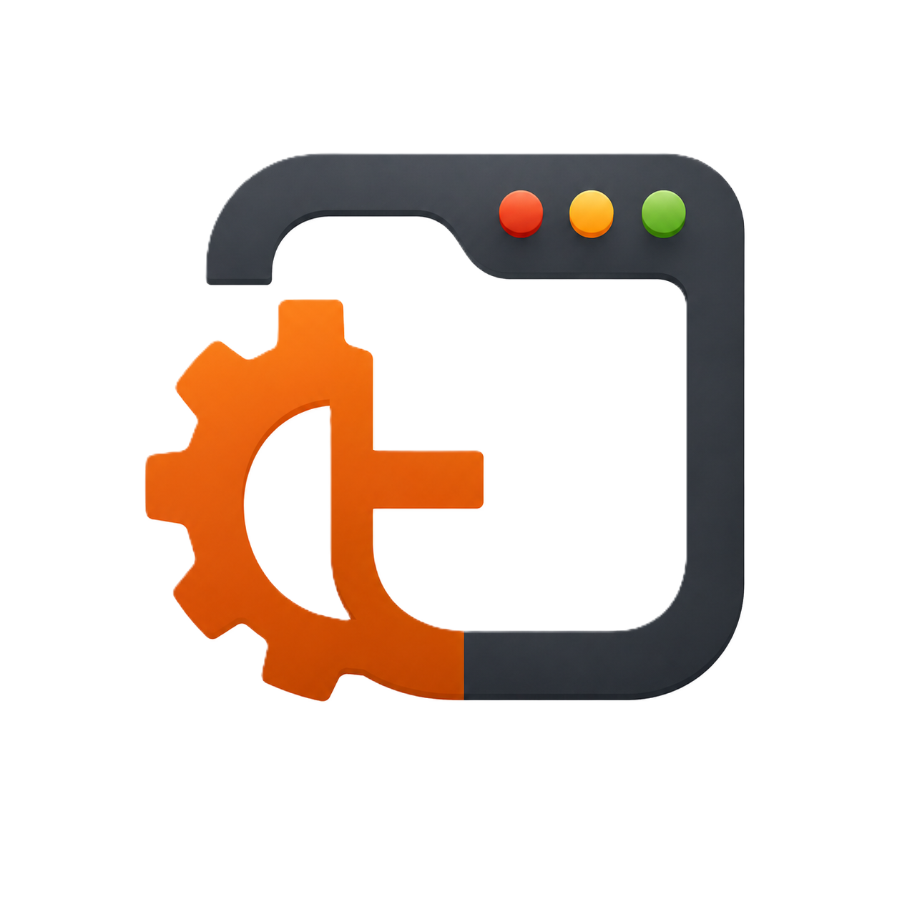

<p align="center">
  
</p>

`tgui` 是一个基于 `wgpu` 的 Rust GUI 框架，强调这几件事：

- GPU 加速渲染
- 轻量 MVVM 状态模型
- 基于 `taffy` 的布局系统
- 声明式组件树 + 可绑定窗口属性
- 内置动画、图片/文本、对话框、画布和可选视频能力

适合做桌面 GUI、工具型应用、可视化面板，以及需要较强自定义绘制能力的界面。

## 当前能力概览

### 应用与窗口

- `Application`：应用入口，配置标题、窗口大小、主题、字体、图标
- `WindowSpec`：声明式多窗口描述
- `bind_title` / `bind_clear_color` / `bind_theme_mode`：将窗口属性绑定到状态
- `on_input`：注册窗口级快捷键/输入触发

### 状态与 MVVM

- `ViewModelContext`：创建响应式状态与动画句柄
- `Observable<T>`：可变状态，更新后自动触发重绘
- `Binding<T>`：从状态派生 UI 值，支持 `map` 和 `animated`
- `Command<T>` / `ValueCommand<T, V>`：把按钮、输入、画布事件接回 ViewModel

### 布局与组件

- 布局：`Stack`、`Grid`、`Flex`
- 基础组件：`Text`、`Button`、`Input`、`Image`
- 画布：`Canvas`、`CanvasPath`、`PathBuilder`、渐变/阴影/布尔运算
- 视频：`VideoSurface`、`VideoController`、`VideoSource`（需启用 `video` feature）

### 样式与基础类型

- 主题：`Theme`、`ThemeMode`、`ThemeSet`
- 颜色：`Color`
- 单位：`dp()`、`sp()`、`Dp`、`Sp`
- 排版：`FontWeight`
- 布局类型：`Align`、`Justify`、`Axis`、`Wrap`、`Overflow`、`Insets`、`Length`、`Track`

### 动画与媒体

- 声明式过渡：`Transition`
- 时间线动画：`AnimatedValue`、`AnimationSpec`、`Keyframes`
- 图片来源：`MediaSource`、`MediaBytes`
- 适配模式：`ContentFit`

### 运行时服务

- 对话框：文件选择、消息框，同步/异步两种调用方式
- 日志：`Log`、`tgui_log`
- 平台导出：`platform::*`

## 安装

```toml
[dependencies]
tgui = "0.1.6"
```

如果需要视频能力：

```toml
[dependencies]
tgui = { version = "0.1.6", features = ["video"] }
```

可选 feature：

- `video`：启用 FFmpeg 视频播放能力
- `video-static`：启用静态链接 FFmpeg 的视频能力
- `android`：启用 Android 入口
- `ohos`：启用 HarmonyOS / OpenHarmony 入口

## 快速开始

`tgui` 只支持 MVVM 启动路径。即使是静态界面，也需要定义一个命名 ViewModel 并显式实现 `ViewModel`。

```rust
use tgui::{
    Application, Axis, Button, Command, Flex, Observable, Text, TguiError, ViewModel,
    ViewModelContext,
};

struct CounterVm {
    count: Observable<u32>,
}

impl CounterVm {
    fn new(ctx: &ViewModelContext) -> Self {
        Self {
            count: ctx.observable(0),
        }
    }

    fn increment(&mut self) {
        self.count.update(|value| *value += 1);
    }

    fn view(&self) -> tgui::Element<Self> {
        Flex::new(Axis::Vertical)
            .child(Text::new(
                self.count.binding().map(|count| format!("Count: {count}")),
            ))
            .child(
                Button::new(Text::new("Increment"))
                    .on_click(Command::new(Self::increment)),
            )
            .into()
    }
}

impl ViewModel for CounterVm {}

fn main() -> Result<(), TguiError> {
    Application::new()
        .with_view_model(CounterVm::new)
        .root_view(CounterVm::view)
        .run()
}
```

## 典型 API 入口

常见应用启动链路大致如下：

```rust
Application::new()
    .title("demo")
    .window_size(dp(960.0), dp(640.0))
    .theme(Theme::dark())
    .with_view_model(AppVm::new)
    .bind_title(AppVm::title)
    .bind_clear_color(AppVm::clear_color)
    .bind_theme_mode(AppVm::theme_mode)
    .on_input(InputTrigger::KeyPressed(/* ... */), Command::new(AppVm::handle_input))
    .root_view(AppVm::view)
    .windows(AppVm::windows)
    .run()
```

其中最常用的公开类型包括：

```rust
Application
WindowSpec
ViewModel
ViewModelContext
Observable<T>
Binding<T>
Command<T>
ValueCommand<T, V>

Stack / Grid / Flex
Text / Button / Input / Image / Canvas

Theme / ThemeMode / ThemeSet / Color
dp / sp / Dp / Sp

Transition
AnimatedValue<T>
AnimationSpec<T>
Keyframes<T>
```

## 仓库示例

仓库内示例基本覆盖了当前主要能力：

- `mvvm_counter`：响应式状态、标题绑定、快捷键输入
- `basic_window`：命名空 ViewModel 驱动的最小完整窗口
- `layout_theme_showcase`：布局容器与自定义主题
- `input`：输入框与 `ValueCommand`
- `canvas`：路径绘制、渐变、阴影、布尔运算、命中事件
- `multi_page_showcase`：多文件多页面综合示例
- `dialogs`：同步/异步文件选择与消息框
- `animation_showcase`：`Binding::animated` 声明式过渡
- `timeline_controller`：时间线动画控制器
- `multi_window`：共享 ViewModel 的多窗口
- `image_example`：本地/网络图片与 SVG
- `video_surface`：视频播放界面

这些示例是独立小工程，运行方式如下：

```bash
cargo run --manifest-path examples/basic_window/Cargo.toml
cargo run --manifest-path examples/mvvm_counter/Cargo.toml
cargo run --manifest-path examples/canvas/Cargo.toml
```

视频示例：

```bash
cargo run --manifest-path examples/video_surface/Cargo.toml
```

当前仓库中的 `video_surface` 示例默认依赖 `tgui` 的 `video-static` feature。

## 图片、画布与视频

### 图片

`Image` 支持：

- 本地路径
- URL
- 内存字节
- SVG 资源加载与栅格化

相关类型：

- `Image`
- `MediaSource`
- `MediaBytes`
- `ContentFit`

### 画布

`Canvas` 适合做自定义图形与交互式绘制，目前公开能力包括：

- `PathBuilder`
- `CanvasPath`
- `CanvasStroke`
- `CanvasLinearGradient`
- `CanvasRadialGradient`
- `CanvasShadow`
- `CanvasBooleanOp`
- `CanvasPointerEvent`

### 通用背景

除 `Canvas` 外，常规控件背景现在也支持更丰富的视觉能力：

- `BackgroundBrush`
- `BackgroundLinearGradient`
- `BackgroundRadialGradient`
- `BackgroundGradientStop`
- `background_brush(...)`
- `background_blur(...)`

`background_blur(...)` 是应用窗口内容上的 backdrop blur，可用于玻璃卡片、磨砂面板和层叠浮层。

### 视频

启用 `video` feature 后可使用：

- `VideoController`
- `VideoSurface`
- `VideoSource`
- `PlaybackState`
- `VideoMetrics`

网络视频如果需要自定义请求头，可以把 header 直接挂在 `VideoSource` 上：

```rust
let source = tgui::VideoSource::url("https://example.com/demo.mp4")
    .with_header("Authorization", "Bearer <token>")
    .with_headers([
        ("Referer", "https://example.com/player"),
        ("Cookie", "session=abc123"),
    ]);

controller.load(source)?;
```

## 多窗口与平台支持

桌面端当前包含 Windows、macOS、Linux 相关实现；同时提供：

- `run_android` / `android` feature
- `run_ohos` / `ohos` feature

多窗口通过 `WindowSpec` 描述，主窗口与子窗口共享同一个 ViewModel，适合做文档窗口、检查器窗口、浮动工具面板等场景。

## 对话框与运行时服务

通过 `Command::new_with_context` 或 `ValueCommand::new_with_context`，可以在命令处理中访问运行时服务：

- `ctx.dialogs()`：文件选择、消息框
- `ctx.log()`：运行时日志

相关类型：

- `Dialogs`
- `FileDialogOptions`
- `MessageDialogOptions`
- `MessageDialogButtons`
- `MessageDialogResult`

## 适合先看哪些文件

- `src/lib.rs`：crate 导出总览
- `src/application/mod.rs`：应用与窗口入口
- `src/foundation/binding.rs`：`Observable` / `Binding`
- `src/foundation/view_model.rs`：`Command` / `ValueCommand`
- `src/ui/widget/*`：组件与布局实现
- `examples/*`：最直接的上手参考

## License

MIT
