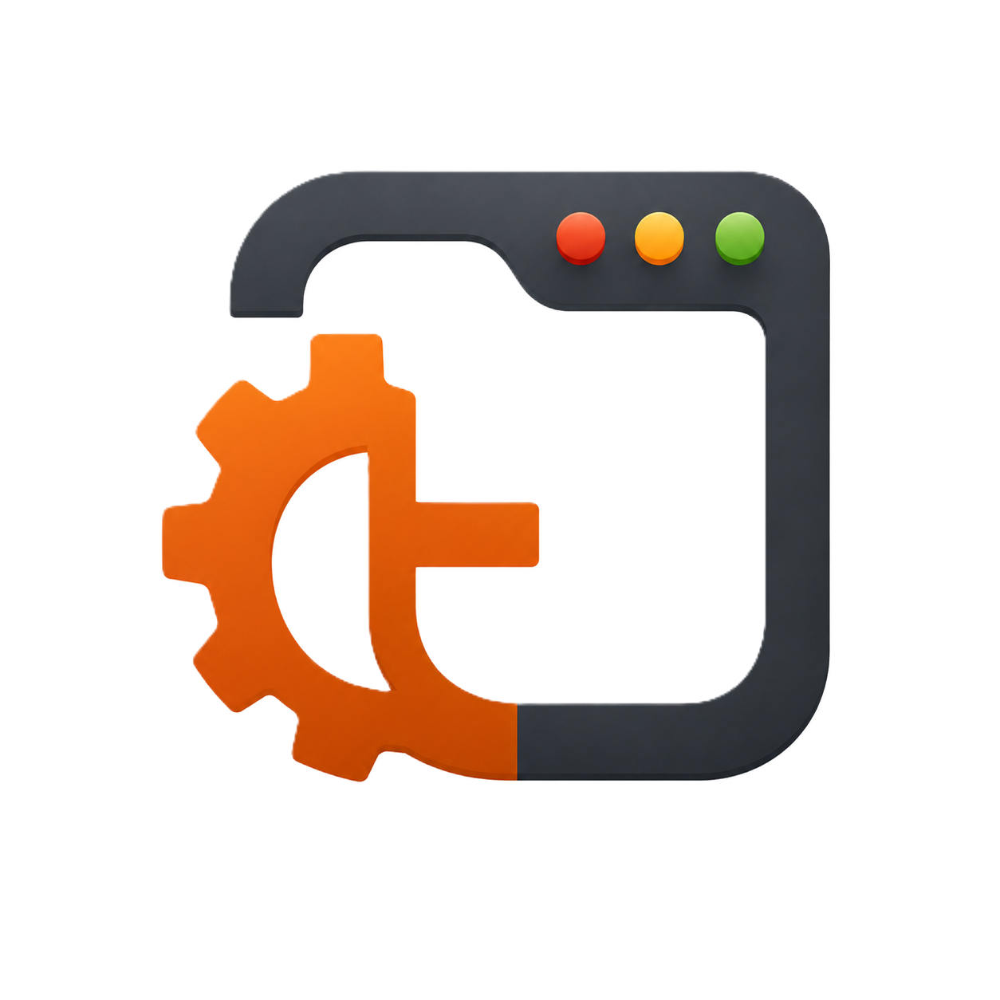

<p align="center">
  
</p>

`tgui` 是一个基于 `wgpu` 的 Rust GUI 框架，强调这几件事：

- GPU 加速渲染
- 轻量 MVVM 状态模型
- 基于 `taffy` 的布局系统
- 声明式组件树 + 可绑定窗口属性
- 内置动画、图片/文本、系统通知、对话框、画布、自定义窗口 chrome 和可选视频能力

适合做桌面 GUI、工具型应用、可视化面板，以及需要较强自定义绘制能力的界面。

## 项目状态

`tgui` 目前已经能够基本使用：应用启动、窗口管理、MVVM 状态绑定、常用布局、基础控件、主题、动画、图片、Canvas、自定义窗口 chrome、系统通知、对话框以及可选视频播放等核心链路已经打通，并配有多个可运行示例。

当前版本仍处于 `0.x` 阶段，公共 API 还可能根据真实应用反馈继续调整。它已经适合用于原型、内部工具、小型桌面应用、可视化面板和自定义绘制界面的探索；如果用于长期维护的生产项目，建议固定 crate 版本，并在升级前阅读 README、示例和变更记录。

## 当前能力概览

### 应用与窗口

- `Application`：应用入口，配置标题、窗口大小、主题、字体、图标
- `app_id(...)`：为通知等平台服务提供稳定应用标识
- `WindowSpec`：声明式多窗口描述
- `bind_title` / `bind_clear_color` / `bind_theme_mode`：将窗口属性绑定到状态
- `decorations(false)`：关闭系统标题栏，用 tgui 自绘窗口 chrome
- `on_input`：注册窗口级快捷键/输入触发

### 状态与 MVVM

- `ViewModelContext`：创建响应式状态与动画句柄
- `Observable<T>`：可变状态，更新后自动触发重绘
- `Binding<T>`：从状态派生 UI 值，支持 `map` 和 `animated`
- `Command<T>` / `ValueCommand<T, V>`：把按钮、输入、画布事件接回 ViewModel
- `CommandContext::window()`：在命令中请求窗口拖拽、拉伸、最小化、最大化/还原、关闭
- `CommandContext::notifications()`：在命令中发送通知、请求权限、处理通知 action 回调

### 布局与组件

- 布局：`Stack`、`Grid`、`Flex`
- 基础组件：`Text`、`Button`、`Radio`、`Checkbox`、`Select`、`Image`
- 画布：`Canvas`、`CanvasPath`、`PathBuilder`、渐变/阴影/布尔运算
- 视频：`VideoSurface`、`VideoController`、`VideoSource`（需启用 `video` feature）

### 样式与基础类型

- 主题：`Theme`、`ThemeMode`、`ThemeSet`
- 颜色：`Color`
- 单位：`dp()`、`sp()`、`Dp`、`Sp`
- 排版：`FontWeight`
- 布局类型：`Align`、`Justify`、`Axis`、`Wrap`、`Overflow`、`Insets`、`Length`、`Track`

### 动画与媒体

- 声明式过渡：`Transition`
- 时间线动画：`AnimatedValue`、`AnimationSpec`、`Keyframes`
- 图片来源：`MediaSource`、`MediaBytes`
- 适配模式：`ContentFit`

### 运行时服务

- 对话框：文件选择、消息框，同步/异步两种调用方式
- 通知：权限查询 / 请求、普通通知、带 action 的交互式通知
- 窗口控制：`WindowControl`、`WindowResizeDirection`
- 日志：`Log`、`tgui_log`
- 平台导出：`platform::*`

## 安装

```toml
[dependencies]
tgui = "0.1.7"
```

如果需要视频能力：

```toml
[dependencies]
tgui = { version = "0.1.7", features = ["video"] }
```

可选 feature：

- `video`：启用 FFmpeg 视频播放能力
- `video-static`：启用静态链接 FFmpeg 的视频能力
- `android`：启用 Android 入口
- `ohos`：启用 HarmonyOS / OpenHarmony 入口

## 公开 API 结构

`tgui` 的公开类型按职责分类导出：

- `application`：应用、窗口和运行入口
- `mvvm`：`ViewModel`、`Observable`、`Binding`、`Command`、`CommandContext`、`WindowControl`
- `layout`：布局容器、尺寸、间距和滚动相关类型
- `widgets` / `canvas`：基础控件、控件树和 Canvas 绘制 API
- `theme`：主题、色板、排版、状态和设计 token
- `core`：颜色、错误、输入触发器、基础单位和几何类型
- `notification`：系统通知、权限与交互式 action
- `media` / `dialog` / `logging` / `platform` / `video`：媒体、对话框、日志、平台和视频能力

示例代码可使用 `tgui::prelude::*` 引入常用 API；库代码建议优先从具体分类模块导入。

## 快速开始

`tgui` 只支持 MVVM 启动路径。即使是静态界面，也需要定义一个命名 ViewModel 并显式实现 `ViewModel`。

```rust
use tgui::prelude::*;

struct CounterVm {
    count: Observable<u32>,
}

impl CounterVm {
    fn increment(&mut self) {
        self.count.update(|value| *value += 1);
    }

    fn view(&self) -> Element<Self> {
        Flex::new(Axis::Vertical)
            .child(Text::new(
                self.count.binding().map(|count| format!("Count: {count}")),
            ))
            .child(
                Button::new("Increment")
                    .on_click(Command::new(Self::increment)),
            )
            .into()
    }
}

impl ViewModel for CounterVm {
    fn new(ctx: &ViewModelContext) -> Self {
        Self {
            count: ctx.observable(0),
        }
    }

    fn view(&self) -> Element<Self> {
        CounterVm::view(self)
    }
}

fn main() -> Result<(), TguiError> {
    Application::new()
        .with_view_model(CounterVm::new)
        .root_view(CounterVm::view)
        .run()
}
```

## 典型 API 入口

常见应用启动链路大致如下：

```rust
Application::new()
    .title("demo")
    .window_size(dp(960.0), dp(640.0))
    .theme(Theme::dark())
    .decorations(true)
    .with_view_model(AppVm::new)
    .bind_title(AppVm::title)
    .bind_clear_color(AppVm::clear_color)
    .bind_theme_mode(AppVm::theme_mode)
    .on_input(InputTrigger::KeyPressed(/* ... */), Command::new(AppVm::handle_input))
    .root_view(AppVm::view)
    .windows(AppVm::windows)
    .run()
```

其中最常用的公开类型包括：

```rust
Application
WindowSpec
ViewModel
ViewModelContext
Observable<T>
Binding<T>
Command<T>
ValueCommand<T, V>
CommandContext<T>
WindowControl
WindowResizeDirection
NotificationOptions
NotificationAction
Notifications

Stack / Grid / Flex
Text / Button / Image / Canvas

Theme / ThemeMode / ThemeSet / Color / FocusRingStyle
dp / sp / Dp / Sp

Transition
AnimatedValue<T>
AnimationSpec<T>
Keyframes<T>
```

## 仓库示例

仓库内示例基本覆盖了当前主要能力：

- `basic_window`：命名空 ViewModel 驱动的最小完整窗口
- `mvvm_counter`：响应式状态、标题绑定、清屏色绑定、快捷键输入
- `animation_showcase`：`Binding::animated` 声明式过渡
- `timeline_controller`：时间线动画控制器
- `multi_window`：共享 ViewModel 的多窗口
- `dialogs`：同步/异步文件选择与消息框
- `canvas`：scene-style 画布，支持 path/text/image/group/clip、渐变、阴影、布尔运算和 item 事件
- `background_effects`：通用渐变背景和 backdrop blur
- `frameless_window`：关闭系统装饰后的自绘标题栏、拖拽、拉伸和窗口按钮
- `demo`：综合展示常用布局、组件、通知和画布
- `text_area`：受控 `Textarea` 编辑示例，读取自身源码但不保存
- `multiple_vm_examples`：多页面 / 多 ViewModel 示例
- `android_basic_window`：Android 入口示例
- `ohos_basic_window`：OpenHarmony / HarmonyOS 入口示例

这些示例是独立小工程，运行方式如下：

```bash
cargo run --manifest-path examples/basic_window/Cargo.toml
cargo run --manifest-path examples/mvvm_counter/Cargo.toml
cargo run --manifest-path examples/canvas/Cargo.toml
cargo run --manifest-path examples/frameless_window/Cargo.toml
```

README 中的示例名称以当前 `examples/` 目录为准；如果新增或删除示例，应同步更新本节和 `examples/README.md`。

## Notification

通知服务通过 `CommandContext::notifications()` 提供，支持：

- `send(...)`：发送普通通知
- `send_with_actions(...)`：发送最多两个 action 的交互式通知
- `request_permission(...)` / `permission_status()`：权限查询与请求

使用通知前，建议在应用入口设置稳定的应用标识：

```rust
Application::new()
    .app_id("com.example.tgui-demo")
    .with_view_model(AppVm::new)
    .root_view(AppVm::view)
    .run()
```

```rust
Button::new("发送通知").on_click(Command::new_with_context(|_, ctx| {
    let _ = ctx.notifications().send(
        NotificationOptions::new("TGUI Demo")
            .body("任务已经完成")
            .app_name("TGUI Demo"),
    );
}))
```

平台说明：

- Windows：建议始终设置 `Application::app_id(...)`，这是通知身份的前置条件。
- Linux：当前通过 `notify-rust` 发送通知，并支持 action 回调。
- macOS：公开 API 已提供，但当前后端仍依赖额外 bridge，调用时可能返回错误。
- Android / OHOS：当前返回 unsupported。

## 图片、画布与视频

### 图片

`Image` 支持：

- 本地路径
- URL
- 内存字节
- SVG 资源加载与栅格化

相关类型：

- `Image`
- `MediaSource`
- `MediaBytes`
- `ContentFit`

### 画布

`Canvas` 适合做自定义图形与交互式绘制，目前公开能力包括：

- `PathBuilder`
- `CanvasPath`
- `CanvasText`
- `CanvasImage`
- `CanvasGroup` / `CanvasClip` / `CanvasLayer` / `CanvasMask`
- `CanvasStroke`
- `CanvasFillRule`
- `CanvasTransform2D`
- `CanvasLinearGradient`
- `CanvasRadialGradient`
- `CanvasShadow`
- `CanvasBooleanOp`
- `CanvasMouseEvent` / `CanvasWheelEvent` / `CanvasDragEvent`

### 通用背景

除 `Canvas` 外，常规控件背景现在也支持更丰富的视觉能力：

- `BackgroundBrush`
- `BackgroundLinearGradient`
- `BackgroundRadialGradient`
- `BackgroundGradientStop`
- `background_brush(...)`
- `background_blur(...)`

`background_blur(...)` 是应用窗口内容上的 backdrop blur，可用于玻璃卡片、磨砂面板和层叠浮层。

### 视频

启用 `video` feature 后可使用：

- `video::VideoController`
- `video::VideoSurface`
- `video::VideoSource`
- `video::PlaybackState`
- `video::VideoMetrics`

网络视频如果需要自定义请求头，可以把 header 直接挂在 `VideoSource` 上：

```rust
let source = tgui::video::VideoSource::url("https://example.com/demo.mp4")
    .with_header("Authorization", "Bearer <token>")
    .with_headers([
        ("Referer", "https://example.com/player"),
        ("Cookie", "session=abc123"),
    ]);

controller.load(source)?;
```

## 多窗口与平台支持

桌面端当前包含 Windows、macOS、Linux 相关实现；同时提供：

- `run_android` / `android` feature
- `run_ohos` / `ohos` feature

多窗口通过 `WindowSpec` 描述，主窗口与子窗口共享同一个 ViewModel，适合做文档窗口、检查器窗口、浮动工具面板等场景。

`Application::decorations(false)` 或 `WindowSpec::decorations(false)` 可以关闭系统标题栏，用普通 tgui 组件自绘窗口 chrome。命令处理里可以通过 `ctx.window()` 操作当前窗口：

```rust
Button::new("Close")
    .on_click(Command::new_with_context(|_, ctx| {
        ctx.window().close();
    }));
```

可用窗口控制包括：

- `drag_window()`
- `drag_resize_window(WindowResizeDirection::SouthEast)`
- `minimize()`
- `maximize()` / `restore()` / `toggle_maximize()`
- `close()`
- `is_maximized()`

透明无边框窗口通常同时设置 `clear_color(Color::TRANSPARENT)`，渲染器会根据 clear color 的 alpha 选择合适的 surface alpha mode。

## 对话框与运行时服务

通过 `Command::new_with_context` 或 `ValueCommand::new_with_context`，可以在命令处理中访问运行时服务：

- `ctx.dialogs()`：文件选择、消息框
- `ctx.notifications()`：系统通知、权限、action 回调
- `ctx.window()`：当前窗口控制
- `ctx.log()`：运行时日志

相关类型：

- `Dialogs`
- `NotificationOptions`
- `NotificationAction`
- `NotificationActionEvent`
- `NotificationError`
- `NotificationPermission`
- `Notifications`
- `FileDialogOptions`
- `MessageDialogOptions`
- `MessageDialogButtons`
- `MessageDialogResult`

## 适合先看哪些文件

- `src/lib.rs`：crate 导出总览
- `src/application/mod.rs`：应用与窗口入口
- `src/foundation/binding.rs`：`Observable` / `Binding`
- `src/foundation/view_model.rs`：`Command` / `ValueCommand`
- `src/notification.rs`：通知、权限与 action 回调
- `src/foundation/window_control.rs`：`WindowControl` / `WindowResizeDirection`
- `src/ui/widget/*`：组件与布局实现
- `examples/frameless_window/src/main.rs`：无边框窗口和窗口控制参考
- `examples/*`：最直接的上手参考

## 贡献指南

欢迎提交 issue、示例、文档和代码改进。`tgui` 的目标是保持 API 易用、行为可预测，同时保留足够强的自定义绘制能力；贡献时建议优先围绕真实使用场景描述问题和改动动机。

提交代码前建议至少运行：

```bash
cargo fmt
cargo check
cargo test
```

如果改动涉及特定 feature 或平台，请尽量补充对应检查：

```bash
cargo check --features video
cargo check --features android
cargo check --features ohos
```

贡献时请注意：

- 公共 API 变更需要同步更新 README、示例和 `src/lib.rs` 中的 re-export。
- 新增 widget 或样式能力时，优先复用现有 `Element`、布局、事件、主题和 `Value<T>` / `Binding<T>` 模式。
- 文本输入或通知能力变更时，建议同时检查 `src/runtime.rs`、`src/notification.rs` 与相关示例。
- 修改 `src/runtime.rs`、`src/ui/widget/core.rs`、渲染 primitive、文本输入、媒体加载或窗口控制时，建议补充针对性的单元测试。
- 新增示例时保持示例独立、可运行，并同步更新 README 中的示例列表。
- 视频相关改动需要考虑 `video` / `video-static` feature，以及本机 FFmpeg 链接环境差异。
- Android / OHOS / 桌面平台相关改动请使用 `cfg` 明确隔离，避免影响其他平台构建。
- 文档和示例同样重要；如果你发现某个 API 已经可用但缺少说明，欢迎直接补充。

较大的功能改动建议先开 issue 讨论设计方向，尤其是涉及公开 API、运行时事件、布局行为、渲染管线或平台抽象的改动。

## License

MIT
